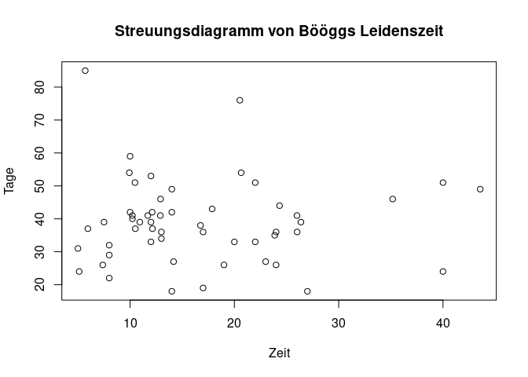

Software Übungen
================

## Aufgabe 1 (5 Punkte)

Aufgabe 13.3.6 im Buch von Ross (vom letzten Semester). Falls Sie das
Buch nicht haben, hier ist eine “Kopie” der Aufgabe im Originalton:

The following data categorize a random selection of professors of a
certain university according to their teaching performance (as measured
by the students in their classes) in the most recent semester and the
number of courses they were teaching at the time.

``` r
# Erstellen des Datensatzes
ross_13_3_6 <- matrix(c(12, 10, 4, 32, 40, 38, 7, 12, 25),
    nrow = 3, byrow = TRUE,
    dimnames = list(c("Above", "Average", "Below"), c("1", "2", "3+"))
)
ross_13_3_6
```

    ##          1  2 3+
    ## Above   12 10  4
    ## Average 32 40 38
    ## Below    7 12 25

Test, at the 5 percent level, the hypothesis that a professor’s teaching
performance is independent of the number of courses she or he is
teaching.

``` r
# Durchführung des Chi-Quadrat-Tests
chisq_test <- chisq.test(ross_13_3_6)
chisq_test
```

    ## 
    ##  Pearson's Chi-squared test
    ## 
    ## data:  ross_13_3_6
    ## X-squared = 14.312, df = 4, p-value = 0.006363

Da der p-Wert kleiner ist als 1%, können wir die Null-Hypothese
verwerfen, dass die Evaluation unabhängig von der Anzahl der Kurse ist.

``` r
round(chisq.test(ross_13_3_6)$expected, 1)
```

    ##            1    2   3+
    ## Above    7.4  9.0  9.7
    ## Average 31.2 37.9 40.9
    ## Below   12.5 15.2 16.4

Ein Vergleich der beobachteten Tabelle mit der erwarteten Tabelle zeigt,
dass Professoren mit einem Kurs besser als erwartet (unter der Null)
abschneiden während Professoren mit drei oder mehr Kursen schlechter als
erwartet (unter der Null) abschneiden. Damit gibt es einen negativen
Zusammenhang zwischen Evaluation und Anzahl der Kurse: wer mehr Kurse
unterrichted, wird im Durchschnit schlechter evaluiert.

## Aufgabe 2 (10 Punkte)

Der Datensatz “Medikament” enthält die Blutdrücke von n = 80 Patienten
vor und nach der Behandlung mit einem Mittel, das hohen Blutdruck senken
soll.

``` r
# Einlesen der Daten für Aufgabe 2
medikament <- read.csv("data/medikament.csv")
head(medikament)
```

    ##   before after
    ## 1  168.5 162.7
    ## 2  172.2 160.5
    ## 3  175.2 168.5
    ## 4  173.2 155.2
    ## 5  164.8 155.0
    ## 6  167.1 153.7

### a) Finden Sie ein 95% Konfidenz-Intervall für die durchschnittliche Blutdruck-Senkung. Erscheint das Medikament somit wirksam?

``` r
# Berechnung des Konfidenz-Intervalls
senkung <- medikament$before - medikament$after
ci <- t.test(senkung)$conf.int
ci
```

    ## [1] 10.21158 13.29842
    ## attr(,"conf.level")
    ## [1] 0.95

Da dieses Konfidenz-Intervall die Null nicht enthält, ist es plausibel,
dass das Medikament im Durchschnitt den Blutdruck senkt.

### b) Berechnen Sie die Stichproben-Korrelation zwischen “before” und “after”.

``` r
# Berechnung der Korrelation
cor(medikament$before, medikament$after)
```

    ## [1] 0.7778159

### c) Wiederholen Sie anhand dieser Daten das Rechenbeispiel von Seite 28 der Folien 1

``` r
# Direkte Berechnung von s_D
sd(senkung)
```

    ## [1] 6.935506

``` r
# Indirekte Berechnung von s_D
sqrt(var(medikament$before) + var(medikament$after) - 2 *
    cor(medikament$before, medikament$after) * sd(medikament$before) * sd(medikament$after))
```

    ## [1] 6.935506

### d) Erscheint das Medikament wirksamer als das Placebo?

Der Trick ist hier wie folgt. Zuerst berechnen wir die paarweise
Differenzen, einmal für das Medikament
() und dann noch einmal für das Placebo (). Dann wenden wir das Konfidenz-Intervall für zwei
unabh$ngige Stichproben auf die zwei Differenz-Stichproben an

``` r
# Einlesen der Placebodaten
placebo <- read.csv("data/placebo.csv")

# Berechnung der Konfidenz-Intervalle für die Differenzen
senkung_placebo <- placebo$before - placebo$after
t.test(senkung, senkung_placebo)$conf.int
```

    ## [1] -1.703946  3.460613
    ## attr(,"conf.level")
    ## [1] 0.95

Da dieses Konfidenz-Intervall die Null enthält, ist es plausibel, dass
das Medikament nicht besser ist als das Placebo.

## Aufgabe 3 (10 Punkte)

Der Datensatz enthält Aktienüberschussrenditen in Prozent für drei
Aktien (Coca Cola, General Electrics und Sun Microsystems) sowie für den
S\&P 500 Aktien-Index von 06/1992 bis 04/2002.

``` r
# Einlesen der Daten für Aufgabe 3
aktien <- read.csv("data/aktien.csv")
head(aktien)
```

    ##   coke.ex general.ex sun.ex sp500.ex
    ## 1   -9.40       1.49  -6.59    -2.05
    ## 2    4.42      -1.88   2.12     3.67
    ## 3    2.43      -3.53   0.21    -2.66
    ## 4   -6.05       5.50  16.05     0.67
    ## 5    0.07      -2.16  12.56    -0.03
    ## 6   -2.41       8.21 -10.19     2.77

### a) Schätze die Parameter  und  des CAPM.

``` r
# CAPM-Modell
fit <- lm(sun.ex ~ sp500.ex, data = aktien)
summary(fit)
```

    ## 
    ## Call:
    ## lm(formula = sun.ex ~ sp500.ex, data = aktien)
    ## 
    ## Residuals:
    ##     Min      1Q  Median      3Q     Max 
    ## -28.663  -8.056   0.973   8.251  24.558 
    ## 
    ## Coefficients:
    ##             Estimate Std. Error t value Pr(>|t|)    
    ## (Intercept)   1.6060     1.1327   1.418    0.159    
    ## sp500.ex      1.8990     0.2752   6.900 2.84e-10 ***
    ## ---
    ## Signif. codes:  0 '***' 0.001 '**' 0.01 '*' 0.05 '.' 0.1 ' ' 1
    ## 
    ## Residual standard error: 12.26 on 117 degrees of freedom
    ## Multiple R-squared:  0.2892, Adjusted R-squared:  0.2832 
    ## F-statistic: 47.61 on 1 and 117 DF,  p-value: 2.84e-10

Wir erhalten die Schätzung  und .

### b) Welches sind die drei einflussreichsten Beobachtungen laut der Cook’s Distance?

``` r
# Berechnung der Cook's Distance
plot(fit, main = "Cook's Distance", which = 4)
```

<!-- -->

``` r
plot(cooks.distance(fit), type = "b", pch = 18, col = "red")
N <- nrow(aktien)
k <- 2
cutoff <- 4 / (N - k - 1)
abline(h = cutoff, lty = 2)
```

<!-- --> Es sind
die Beobachtungen 94, 105 und 114. Allerdings hat keine dieser
Beobachtungen eine Cook’s Distance, die als \`aussergewöhnlich’ in
Relation zur Grundgesamtheit beurteilt werden kann. Bemerkung: Es ist
hier nicht hilfreich, sich univariate Boxplots anzuschauen. Datenpunkte,
die univariate Ausreisser sind (z.B. in der Stichprobe der Sun-Daten)
müssen keine Ausreisser in der bivariaten Beziehung S\&P–Sun mehr sein
und umgekehrt\!

### c) Kann die Aktie als ‘defensiv’ oder ‘aggressiv’ beurteilt werden?

``` r
# Konfidenz-Intervall für Beta
confint(fit)["sp500.ex", ]
```

    ##    2.5 %   97.5 % 
    ## 1.353941 2.443974

Da dieses KI die 1 nicht enthält, können wir die Aktie als \`aggressiv’
in Relation zum Indexbeurteilen.

### d) Gibt es Anzeichen dafür, dass das CAPM verletzt ist?

Wir testen  gegen .

``` r
# Hypothesentest für Alpha
summary(fit)$coefficients["(Intercept)", ]
```

    ##   Estimate Std. Error    t value   Pr(>|t|) 
    ##  1.6059517  1.1327348  1.4177650  0.1589172

Der zugehörige
-Wert (direkt von {R} berechnet für uns) ist 0.159. Daher gibt es
kein Anzeichen für eine Verletzung des CAPM. Wir kommen zum gleichen
Ergebnis wenn wir ein 95% Konfidenz-Intervall f"ur
 in der folgenden Weise berechnen: ![1.606 \\pm 1.96
\\times 1.133 =
\[-0.62, 3.83\]](https://latex.codecogs.com/png.image?%5Cdpi%7B110%7D&space;%5Cbg_white&space;1.606%20%5Cpm%201.96%20%5Ctimes%201.133%20%3D%20%5B-0.62%2C%203.83%5D
"1.606 \\pm 1.96 \\times 1.133 = [-0.62, 3.83]"). Da dieses Intervall
die 0 enthält, ist es \`plausibel’, dass  und somit können wir
 nicht verwerfen. Bemerkung: ein Test für die Differenz der beiden
Mittelwerte (Aktivum und Markt) ist hier nicht angebracht\! Wenn ein
Aktivum ein  hat, dann kann  sein, obwohl der Erwartungswert des Aktivums kleiner ist
als der des Marktes.

### e) Vorhersage der Überschussrendite bei einer neuen Monatsrisikoprämie von 3%

``` r
# Vorhersage
new_data <- data.frame(sp500.ex = 3)
predict(fit, newdata = new_data)
```

    ##        1 
    ## 7.302824

Die Vorhersage ist 7.31. Allerdings ist diese Vorhersage nicht sehr
zuverlässig, da . D.h. die Risiko-Pr$mie des Indexes erklärt nur 29% der
Variation der Risiko-Prämie von Sun Microsystems.

### f) 95% Konfidenz-Intervall für die erwartete Überschussrendite

``` r
# Konfidenz-Intervall
predict(fit, newdata = new_data, interval = "confidence")
```

    ##        fit      lwr      upr
    ## 1 7.302824 4.698463 9.907186

## Aufgabe 4 (10 Punkte)

Der Datensatz enthält die Leidenszeit des Bööggs (“time”) und die Anzahl
der Sommertage (“days”) für die Jahre 1965 bis 2018.

``` r
# Einlesen der Daten für Aufgabe 4
boegg <- read.csv("data/boegg.csv")
head(boegg)
```

    ##   year days time
    ## 1 1965   33   20
    ## 2 1966   42   10
    ## 3 1967   59   10
    ## 4 1968   32    8
    ## 5 1969   49   14
    ## 6 1970   51   40

### a) Erstellen Sie ein Streuungs-Diagramm und beurteilen Sie die Beziehung.

``` r
# Streudiagramm
plot(boegg$time, boegg$days, xlab = "Time", ylab = "Days", main = "Scatterplot of Time vs Days")
```

<!-- -->

### b) Wie lautet das geschätzte Modell?

``` r
# Lineares Modell
fit_boegg <- lm(days ~ time, data = boegg)
summary(fit_boegg)
```

    ## 
    ## Call:
    ## lm(formula = days ~ time, data = boegg)
    ## 
    ## Residuals:
    ##     Min      1Q  Median      3Q     Max 
    ## -21.044  -6.843  -0.563   4.791  45.874 
    ## 
    ## Coefficients:
    ##              Estimate Std. Error t value Pr(>|t|)    
    ## (Intercept) 39.181278   3.686662   10.63 1.22e-14 ***
    ## time        -0.009776   0.194991   -0.05     0.96    
    ## ---
    ## Signif. codes:  0 '***' 0.001 '**' 0.01 '*' 0.05 '.' 0.1 ' ' 1
    ## 
    ## Residual standard error: 12.84 on 52 degrees of freedom
    ## Multiple R-squared:  4.834e-05,  Adjusted R-squared:  -0.01918 
    ## F-statistic: 0.002514 on 1 and 52 DF,  p-value: 0.9602

Die Beziehung ist sehr schwach, da weniger als 0.01% der beobachteten
Variation in days durch time erklärt wird.

### c) Evidenz für die Behauptung des Volksmunds

``` r
# Hypothesentest
summary(fit_boegg)$coefficients["time", ]
```

    ##    Estimate  Std. Error     t value    Pr(>|t|) 
    ## -0.00977622  0.19499126 -0.05013671  0.96020554

Der (einseitige)
-Wert ist 0.96/2 = 0.48 (da die Test-Statistik negativ ist). Daher
haben wir keine Evidenz für die Behauptung des Volksmunds.

### d) Vorhersage der Sommertage im Jahr 2019

``` r
# Vorhersage für 2019
new_data <- data.frame(time = 17.73)
predict(fit_boegg, newdata = new_data, interval = "prediction", level = 0.90)
```

    ##        fit      lwr      upr
    ## 1 39.00795 17.30444 60.71145

Die Vorhersage ist . Das Vorhersage-Intervall ist
![\[17.3, 60.7\]](https://latex.codecogs.com/png.image?%5Cdpi%7B110%7D&space;%5Cbg_white&space;%5B17.3%2C%2060.7%5D
"[17.3, 60.7]"). Es wäre aber keine gute Idee: sowohl vom
Streuungs-Diagramm mit geschätzter Gerade als auch vom
Normal-Quantil-Plot können wir sehen, dass die Residuen rechtsschief
sind.

### e) Änderung der Ergebnisse ohne einflussreiche Beobachtungen

``` r
# Entfernung der einflussreichen Beobachtungen
cooksd_boegg <- cooks.distance(fit_boegg)
influential_boegg <- which(cooksd_boegg > (4 / (nrow(boegg) - 2 - 1)))
boegg_no_infl <- boegg[-influential_boegg, ]

# Neues Modell ohne einflussreiche Beobachtungen
fit_boegg_no_infl <- lm(days ~ time, data = boegg_no_infl)
summary(fit_boegg_no_infl)
```

    ## 
    ## Call:
    ## lm(formula = days ~ time, data = boegg_no_infl)
    ## 
    ## Residuals:
    ##      Min       1Q   Median       3Q      Max 
    ## -19.1848  -5.1901  -0.1865   4.8135  21.8116 
    ## 
    ## Coefficients:
    ##              Estimate Std. Error t value Pr(>|t|)    
    ## (Intercept) 37.197221   3.405213  10.924 1.71e-14 ***
    ## time        -0.000886   0.203268  -0.004    0.997    
    ## ---
    ## Signif. codes:  0 '***' 0.001 '**' 0.01 '*' 0.05 '.' 0.1 ' ' 1
    ## 
    ## Residual standard error: 9.738 on 47 degrees of freedom
    ## Multiple R-squared:  4.042e-07,  Adjusted R-squared:  -0.02128 
    ## F-statistic: 1.9e-05 on 1 and 47 DF,  p-value: 0.9965

``` r
predict(fit_boegg_no_infl, data.frame(year = 2019, days = 10, time = 17.73),
    interval = "prediction", level = 0.90
)
```

    ##        fit      lwr      upr
    ## 1 37.18151 20.65428 53.70875

Wenn diese Beobachtung entfernt wird, ändert sich so gut wie nichts.
